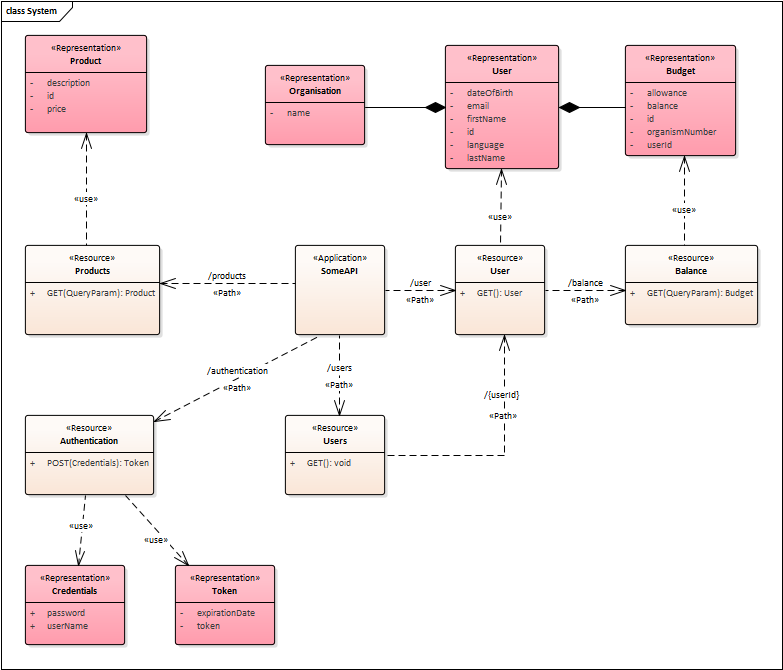

# API Design (with UML Class Diagram)

To figure out which endpoints you need, there are a few different approaches you can take:

- Start with the ER model of the backend database. Determine which entities and relationships you want to expose externally through APIs, and then create the corresponding routes. Generally, these routes will implement CRUD methods for those entities.
- Begin by analyzing the application's use case diagram. From this, identify the processes and actions you want to make available to the user, and create APIs for them. In this approach, the focus is more on actions and processes rather than the data stored in the database.
- You might simply need to expose functions or utilities externally. These functions don't necessarily interact with a database and are therefore stateless: they take input data, perform some processing, and return an output value.

In the first scenario, you'd have an ER model where the entities roughly correspond to the tables in your database. These tables then become the entities for your REST APIs.

You could model the database, or just the entities you want to expose, using a UML class diagram:



This image clearly shows how entities are mapped (almost one-to-one) to objects in the UML diagram. These objects then serve as the inputs/outputs for the functions, or routes, of your REST endpoints.

In this specific case, some common UML stereotypes for REST API engineering are used:

- **application**: this block defines the **general structure of the response** (envelope) that the API might return, rather than a specific resource. It can, and should, define some attributes or metadata surrounding the requested data, such as:
    - `code`: likely a numeric code (like an HTTP status code or an application-specific error code) indicating the operation's outcome.
    - `type`: a string that could categorize the response type (e.g., "success", "error", "validation").
    - `message`: a human-readable string providing details about the operation's outcome or any errors.
    - and others that we'll look at later.

    ```python
    # <<Application>> SomeAPI
    -----------------------------------------------------------------
    code: int # HTTP return code
    type: str
    message: str
    items: dict # iterable with all data
    ...
    ```

    Even the envelope itself requires coding a specific object, which, however, doesn't belong to the database entities but is exclusive to the application, particularly the APIs.

- **path**: indicates the route or sub-route name, like in `user/balance`.
- **use**: shows that an object is used by an API.
- **representation**: corresponds to the objects or entities you want to manage with the endpoints.
- **resource**: acts as a container for the methods and specific attributes of a route.
    - The methods correspond to the allowed HTTP methods for that route, indicating any input and output parameters:

    ```python
    # <<Resource>> Order
    + GET(order_id: int): Order
    - POST(order_id: int, order_name: str, amount: float): Order
    ```

This is an example of a possible implementation for the Order resource:

- The first method, GET, returns the details (i.e., the object itself) of the order based on its ID and is publicly accessible (+) without needing authentication (unlikely in a real scenario, LOL).
- The second method, POST, requires authentication (-) and takes 3 input parameters. Parameters in POST requests are passed in the body. Both functions (endpoints) return an Order object (which will be specified in a red <<Representation>> block declared somewhere).

The <<Resource>> blocks can be extended by adding attributes to specify properties calculated internally by the function handling that endpoint, which aren't part of the object returned by the route itself. In other words, these attributes are additional metadata surrounding the data returned by the route, fields of the envelope itself, similar to what was done with the <<Application>> block:

```python
# <<Resource>> Order
----------------------------------------------------------------------------------
n_orders: int # total orders
----------------------------------------------------------------------------------
+ GET(order_id: int): Order
+ GET(): List[Order]
- POST(order_id: int, order_name: str, amount: float): Order
```

Resource attributes, being calculated by the route-handling function rather than taken directly from the database, generally don't have a state; they aren't saved or tracked. They are just data pre-calculated by the server for convenience and are useful on the client side. They act as on-the-spot "statistics" for the just-returned data; saving them would be redundant in the database.

Next, let's look at how to structure the names of APIs and resources, and what naming conventions to follow.
