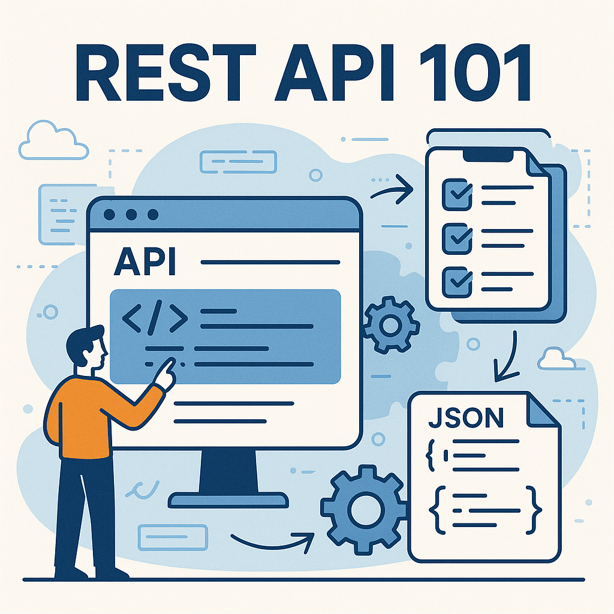

    

        

            <a href="rest_api_101/index">
                <h2>REST API 101</h2>
                
From design to implementation

            </a>
        

        

            
        

    

    

        

            <a href="malware_development/index">
                <h2>Malware development</h2>
                
Payload, dropper and C&C server

            </a>
        

        

            
        

    

