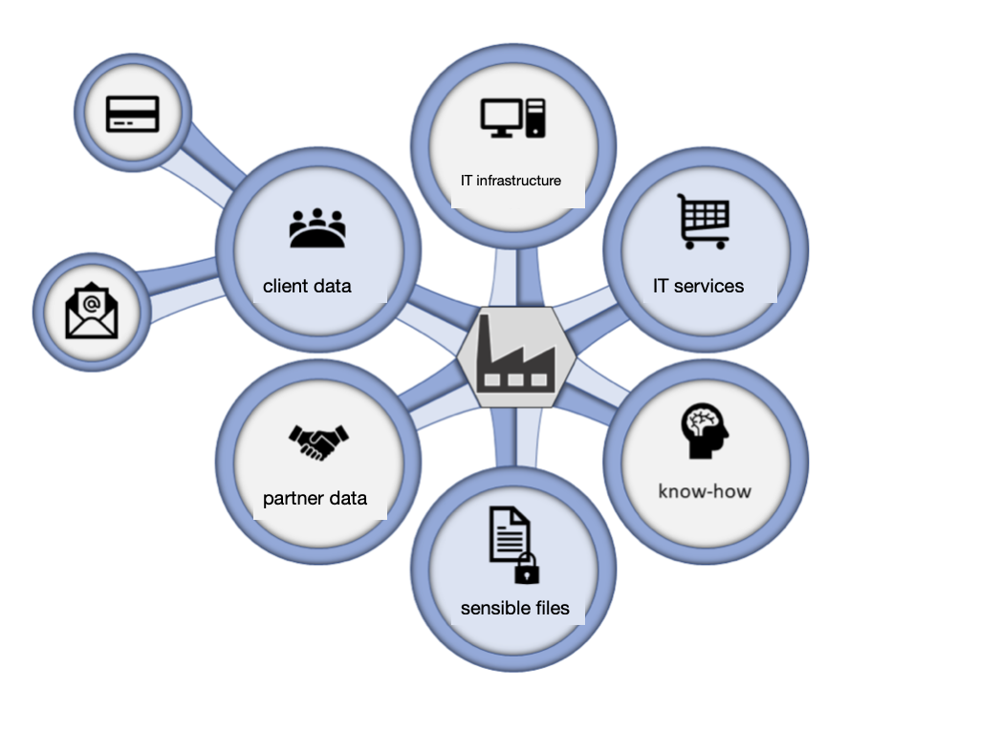
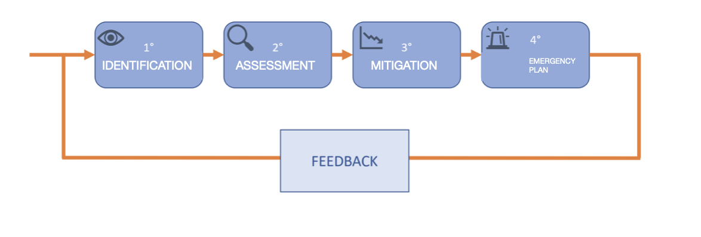

# Chapter 1: Red teaming, phishing campaign and malware

This chapter describes the phenomenon of cybercrime, discusses the importance of security tests, and how malware is used in them. 

## 1.1 Cybercrime

In the last decade, information technology has pervaded every aspect of our lives. Many now find themselves doing their work with the help of an electronic computer connected to the Internet and, after work hours, "chatting" with their friends on the social network of the moment. If this digitalization has led, on the one hand, to carrying out various operations more efficiently, on the other, it exposes us to countless risks. No license is required to use a smartphone; anyone, from children to the elderly, can use a device connected to the Internet; however, only a few perceive the potential threats. The combination of the vast spread of devices (personal and non-personal) connected to the network and very low awareness of the related threats constitutes the perfect ecosystem for the proliferation of cyber attacks. Not all digital crimes are the same. Cybercrime is distinguished from others by its criminal intent for profit. Data from the latest Clusit report (2020) show that computer crimes grew by 37% between 2017 and 2018 and increased by only 7% from 2018 to 2019. This latter figure appears so inconsistent with the growth trend of attacks that, Clusit says, it could be due to underreporting by victims¹. 

Regarding the impacts, the numbers speak for themselves: between 2011 and 2017, the costs generated globally by cybercriminal activities alone quintupled, rising from just over 100 billion dollars in 2011 to over 500 billion in 2017, when scams, extortions, theft of money and personal data affected almost a billion people worldwide, causing an estimated loss of 180 billion dollars to private citizens alone. Today (2019), cyber risks are mentioned in the World Economic Forum's Global Risk Report in first place for impact and probability of occurrence, along with natural disasters and the global effects of climate change². But it is not so much the numerical data that is frightening, but rather the underlying qualitative element; today the phenomenon aims to interfere heavily not only in the private lives of citizens (generally victims of large-scale extortion crimes) but also on a financial and geopolitical level. Cybercrime very often strikes through automated attacks (thus increasing the chances of success); therefore, all companies fall, albeit without particular reasons, into this list of victims, regardless of their assets, simply because they have at least one computer connected to the network. The objectives of the attacks can be varied, from customer data (credit cards, e-mails) and business partners (in the case of industrial espionage) to the company's own data (sensitive data concerning the business and its employees, know-how) up to actual sabotage of the physical infrastructure and/or services offered (Figure 1.1). 

**Figure 1.1. Possible targets of a cyber attack.** 

¹ Clusit reports analyze the year prior to their publication; consequently, the current report refers to 2019.

² https://www.weforum.org/reports/the-global-risks-report-2019 

### 1.1.1 The consequences

The consequences of computer abuse are divided into three categories:

* **Economic losses**, due to the actual theft of money through unauthorized payments, the theft of information (know-how), with a consequent loss of part of the market, or the inability to provide a service (e.g., e-commerce), with a consequent loss of potential profits (DDoS attacks). The damage does not end there; in fact, very often, organizations that fall victim to this type of attack also have to bear the costs of restoring the infrastructure and, if they do not take precautions, it is very likely that the problem will recur. 
* **Image damage**, caused by attacks that erode the company's reputation, causing customers, investors, and suppliers to lose trust in it. A side effect of this damage is, clearly, monetary loss. However, while the latter can be cushioned by taking out insurance, image damage is more difficult to mitigate and can lead to the closure of the business. 
* **Legal consequences**, due to the loss of third-party data (generally customers or partners), who then seek compensation from the attacked company for the damage they have received. The loss of sensitive data, whether it belongs to customers, partners, or the company itself, often also leads to image damage, as well as financial penalties. 

### 1.1.2 The remedies

It can therefore be concluded that the consequences of an attack are multiple and often interrelated; these consequences, if not adequately considered by taking appropriate countermeasures, can recur and strike the same target again, probably causing its closure. To protect against these catastrophic events, one must first have a clear understanding of the initial situation by identifying, monitoring, and managing the potential cyber risks to which the business is exposed, and then planning the right countermeasures to eliminate, or more realistically to mitigate, these threats. This set of actions is called "risk management" and is divided into four fundamental parts:

1.  **Identification and enumeration of risks;** all possible risks to which the company is exposed are identified and listed. In addition to the risks of cyber attacks, possible problems due to natural disasters, malfunctions of providers (electricity and/or telephone line operator), and possible incidents due to human error are also reported. 
2.  **Risk assessment;** an increasing score is assigned to each risk: the higher the value, the greater the damage that this threat can cause to the business. The estimate of this number can be obtained by multiplying the possible damage that the threat in question could cause by the probability that such an event could occur and by the number of times the event repeats itself in a fixed period. 
3.  **Risk mitigation;** action is taken on one of the three factors previously mentioned to reduce the risk of the threat, optimistically trying to make it zero. 
4.  **Development of an emergency plan (incident response);** a protocol is created that allows the company to react to an incident (be it a cyber attack or a natural disaster) in a short time, restoring the initial situation and limiting losses. 

Performing the analysis only once is not sufficient to guarantee the protection of the business; in fact, threats, especially cyber threats, are constantly evolving and, to have an effective plan, it is necessary to repeat the risk assessment periodically, integrating more recent data (Figure 1.2). 

**Figure 1.2. Risk management process.** 

To properly assess the cyber risks to which the company is exposed, specific tests are often used. 

## 1.2 Types of tests

In light of the worrying picture highlighted in the previous section, the need to defend against these digital threats is evident. To estimate the so-called "security posture" of a company, i.e., the degree of security of the company, security tests are used. Based on the results of the tests, it is then possible to understand where to concentrate attention to increase the business's resistance to cybercriminal actions. In this section, we will delve into the discussion of testing techniques, presenting the three main categories into which they are divided and discussing the pros and cons of each. 

### 1.2.1 Penetration test

This type of verification can enumerate and assess the danger of cyber threats by, essentially, simulating a cyber attack, with prior authorization from the company under examination, which brings to light all the flaws in the perimeter (or internally, if the test is conducted as an insider) that the business must face. The analysis is conducted from the point of view of a potential attacker and consists of exploiting the detected vulnerabilities in order to obtain as much information as possible to gain unauthorized access to the system. A penetration test (hereinafter, PT) can help determine whether the system's defenses are sufficient or whether it has vulnerabilities. An exhaustive list of the security problems detected is then presented to the client, together with an assessment of the impact of the vulnerabilities on the system and on the company's business scenario. The report is also accompanied by a technical solution or a risk mitigation proposal, thus covering, at least as regards IT-related threats, the first three points listed above in the risk management section. The duration of this type of test is generally short; we are talking, in fact, about two or three weeks. The objective of each penetration test, as well as its execution, can vary according to the client's needs. It is possible to identify four main properties of a PT:

* **The perspective from which the attack is launched;** this can be:
    * **Internal;** the tester acts as a member of the organization itself, for example, an employee. 
    * **External;** the attacker is completely unrelated to the company context. 
* **The initial information provided to the tester;** it is possible to identify three modes:
    * **Black box;** no information is provided on the system to be attacked. Generally, the test is conducted automatically with the aid of tools, in a so-called "trial and error" approach. 
    * **White box;** all the information needed to conduct the analysis is provided, from the source codes of web applications to network architecture diagrams. This approach should allow the analyst to find all possible vulnerabilities, even the most insidious ones. 
    * **Grey box;** a limited set of information is provided. This type, as the name suggests, is exactly halfway between the two aforementioned. 
* **The type of attack;** from this point of view we can consider the following cases:
    * **Network services;** involves the analysis of the network infrastructure and related services. It can be carried out on-site or remotely (it is generally advisable to carry out both approaches). 
    * **Web app;** is the analysis of web applications. It involves carrying out code reviews, if the source code of the application is available; otherwise, fuzzy analyses are performed. 
    * **Client side;** is the analysis carried out as an insider and is aimed at bypassing the system's defenses from within. Applications on the infrastructure's own computers are exploited, without the need, as happens for the network service type, to use the Internet to convey the attack. 
    * **Wireless;** as the name suggests, it is the type of attack that involves the analysis of all wireless devices within the system: smartphones, tablets, notebooks, and routers. Generally, this type is conducted on-site (as an insider or by getting as close as possible to the perimeter), for obvious reasons related to the strength of the WiFi signal. 

### 1.2.2 Red teaming

Red teaming, which in some ways resembles penetration testing, has a completely different philosophy. In red team operations, the simulation of the adversary (the cybercriminal) is more realistic, the objective specific, and the duration decidedly longer (generally months). Penetration testing aims to identify and validate the largest number of vulnerabilities present on a company's systems. It does not provide any indication as to what actions a real attacker might take. Red teaming, on the other hand, does not provide precise information on all the vulnerabilities present on the systems, but it is able to show what the operating methods of an attacker who wants to access company information might be (attack path). In other words, the entire test is geared towards achieving a precise objective, without getting lost in surrounding details. The result, therefore, does not aim to provide an exhaustive list of improvements to be made to the system, but rather a report designed to highlight the vulnerabilities, if found, related to a specific business task. For this type of test, the usable techniques are more varied than in PT. The aim is to give more freedom to the red team operator who, therefore, will best emulate the action of a malicious hacker. In contexts such as red teaming, we can find operations of physical intrusion into the company premises, social engineering, and targeted phishing (spear phishing). 

### 1.2.3 Phishing campaign

Phishing is a type of scam carried out on the Internet through which a malicious individual tries to deceive the victim into providing personal information, financial data, or access codes, by posing as a reliable entity, a customer, or a supplier. To prevent company employees from falling into this type of trap, a simulated phishing campaign is used to verify, on the one hand, the education of company employees on cybersecurity issues, and on the
other, the readiness of the blue team to identify the ongoing threat and block it promptly. This type of test makes extensive use of social engineering techniques adopted to disguise the scam as a legitimate request. In particular, the most commonly used vector is email; emails containing false information are sent that encourage dangerous actions; other times, emails contain a malicious attachment that, once downloaded and executed, grants the attacker full access to the system. The attack can have a specific target (an employee or a small group of employees) or occur on a large scale and, therefore, involve all members of the company. In the first case, we speak of spear phishing, and the threat is greater; in fact, the attacker builds an ad hoc attack vector that will, therefore, have a higher probability of success. In the case, however, of a large-scale attack, precisely a phishing campaign, the vector used cannot be customized for each target (it would take too much time); in this case, therefore, a generic solution is used whose success rate is, on average, lower. 

## 1.3 The role of malware

In all the types of tests illustrated so far, malware, in its meaning of malicious program, plays a primary role. Malware is used in various security tests to obtain a persistent access point to the attacked system, through which to carry out all the necessary movements to complete the test, whatever its nature. Generally, the software used are binary codes that allow the operator to execute arbitrary commands on the target machine; this type of program gives full freedom of movement to the tester who, therefore, can take the most appropriate path based on their objectives. 

### 1.3.1 Types of malware

Malware differs in the actions it performs on the infected system and the replication method it uses. Below we list the main classes of malicious software:

* **Viruses;** are pieces of code that spread by copying themselves into other programs, or into a particular section of the hard disk, so that they are executed every time the infected file is opened. They are transmitted from one computer to another through the movement of infected files by users. 
* **Trojan horse;** are software that, in addition to having "legitimate" functionalities useful for inducing the user to use them, contain harmful instructions that are executed without the user's knowledge. They do not have self-replication functions; therefore, to spread, they must be knowingly sent to the victim. The name comes from the famous myth of the Trojan horse. 
* **Backdoor;** literally "back door". These are programs that allow unauthorized access to the system on which they are running. They represent the type most used by testers. 
* **Spyware;** are software used to collect information from the system on which they are installed and to transmit it to an interested recipient. The information stolen can range from Browse habits to passwords and cryptographic keys of a user. 
* **Ransomware;** are viruses that encrypt the machine's data using a symmetric encryption algorithm and ask the victim for a ransom in exchange for the key needed to decrypt and get their data back. Nowadays, they are also very common on mobile devices. 

The malware used in security tests is very similar to that used by cybercriminals; indeed, in some cases, they are exactly the same. The objective of the tests, however, is not to cause damage to the systems under analysis; therefore, particular attention is paid to how these programs are used, trying, on the one hand, to faithfully emulate the behavior of a malicious agent, and on the other, not to compromise the capabilities and services of the client's system. In real contexts, on large-scale attacks, the use of malware capable of working and spreading autonomously is preferred, therefore, software such as ransomware, spyware, and viruses are used. In simulated scenarios, however, backdoors are preferred, which allow the tester to decide which actions to take on the compromised systems. In the next chapter, we will discuss the structure of malware in detail, referring, in particular, to those belonging to the "backdoor" category. 