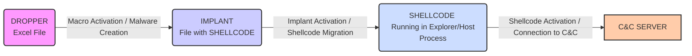

# Chapter 4: Development of a malware

The following chapter introduces the malware we developed for this thesis work and presents the environment used for its realization.

## 4.1 Case study

In Chapter 2, we talked about the fundamental components of a malware and their functions. In this section, however, we will focus more on our case study, giving an overview of its functionalities and the technologies used for its development. In the following chapters, then, each component of the software will be detailed further, also using code snippets and images.

### 4.1.1 The components

Our malware consists of four parts; the first, already seen previously, are the shellcode, the implant, and the Excel dropper, while the last part, not yet explained, is the server-side component that will handle the persistence phase.

In Figure 4.1, we can see the steps that our malware performs from the beginning of the infection until the end of its activity, when it returns control to the attacker awaiting other commands (quiescence phase, Chapter 2).

**(Figure 4.1. The procedure with which our malware infects its victim.)**

At each step, a different component comes into play. These components are:

* **The shellcode,** which is the heart of the malware; it is responsible for returning control to the attacker as soon as it is executed. Being automatically generated using Metasploit, it needs to be adequately obfuscated.
* **The implant;** this is the code that allows the shellcode to start, but, even before that, ensures its integrity until the moment of activation. In fact, it is precisely the implant that, thanks to obfuscation techniques, prevents AV software from detecting our shellcode and, therefore, guarantees that it arrives intact until the moment of "hatching."
* **The dropper** is the file, in this case from the Office suite, that "transports" our malware. Its task is far from simple; in fact, in addition to its main task, it performs some "cleanup" actions (erasing traces).

## 4.2 Work environment

For the creation of the malware, we used several virtual machines; one of them was used to develop our malware, while the others were used to test it.

Below we report the setup used on the machine where we developed the software:

* **VS build tools;** this is a collection of programs usable for the production of C/C++ code for Microsoft systems. It integrates tools such as the C++ compiler, the software for creating .rc files (executable resources), and the Windows APIs.
* **Metasploit Framework;** this is a set of tools, among which we mention msfvenom, for the creation of shellcodes, and msfconsole, for interaction with payloads through handlers. It is widely used in the first phase of development, for payload creation, and in the final phase, relating to persistence.
* **Office Suite;** it is useful for creating and modifying the dropper.
* **X64dbg;** this is a debugger for 64-bit architectures. Used in the preliminary part to better understand the implant and verify its correct functioning. Specifically, it was adopted to check that it correctly decrypted the shellcode, allowing us to load it intact and functional into memory.
* **Process Hacker;** this is an upgrade of the more famous "task manager" utility. It allows you to control in a very meticulous way all the details of each process, from children to parents, the resources used, the libraries loaded, and much more. It represents valuable support when developing malware and, for obvious time reasons, it is not always possible to use a debugger.

As for the slave machines, i.e., those used for testing, we used two versions of Windows.

The first machine uses a Windows 10 Enterprise edition system. The operating system build is not perfectly up-to-date; in fact, the day we started testing our malware, we disabled automatic Windows Defender updates and, for safety, disconnected the machine from the Internet. This is a mandatory practice to prevent our malware from suddenly stopping working due to an unwanted automatic update that invalidates the entire test. Currently, the virtual machine runs Version 1809 of Windows Enterprise and Version 1.321.2115.0 of Windows Defender (Figures 4.2 and 4.3).

**(Figure 4.2. The version of the Windows Enterprise operating system installed on the virtual machine.)**
*(Image: Windows specifications: Edition Windows 10 Enterprise Evaluation, Version 1809, Installed on 3/19/2019, OS build 17763.1397)*

**(Figure 4.3. The version of Defender on the Windows Enterprise operating system.)**
*(Image: System information: Antimalware Client Version: 4.18.2008.9, Engine Version: 1.1.17400.5, Antivirus Version: 1.323.1415.0, Antispyware Version: 1.323.1415.0 - Note: The Antivirus Version in the image text (1.323.1415.0) differs from the PDF text (1.321.2115.0). I will use the version mentioned in the PDF text for consistency with the author's description, but it's important to note this discrepancy.)*

The second machine, on the other hand, is a server system, specifically Windows Server 2019. Having been imported into VirtualBox after the Enterprise machine, the version of Windows Defender is more up-to-date than the other machine. The build and Windows Defender versions are, respectively, 1809 and 1.323.1194.0 (Figures 4.4 and 4.5). This machine too, immediately after being started for the first time and having performed all the necessary updates, was disconnected from the LAN to avoid any automatic updates.

**(Figure 4.4. The version of the Windows Server 2019 operating system installed on the second machine.)**
*(Image: Windows specifications: Edition Windows Server 2019 Datacenter Evaluation, Version 1809, Installed on 15/09/2020, OS build 17763.1457)*

**(Figure 4.5. The version of Defender on the Windows Server 2019 operating system.)**
*(Image: System information: Antimalware Client Version: 4.18.2008.9, Engine Version: 1.1.17400.5, Antivirus Version: 1.323.1194.0, Antispyware Version: 1.323.1194.0)*