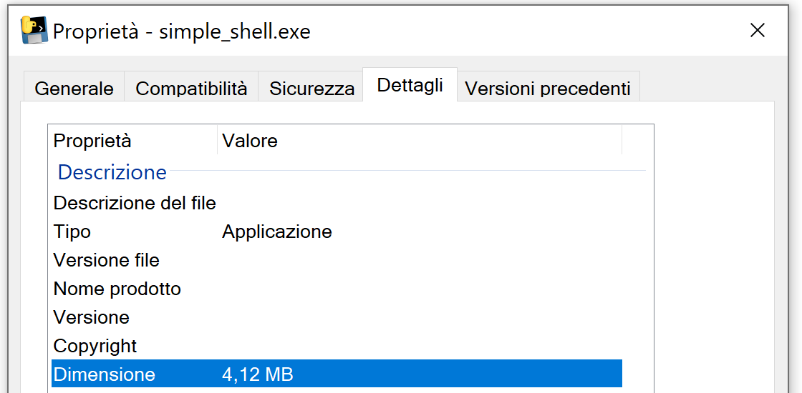
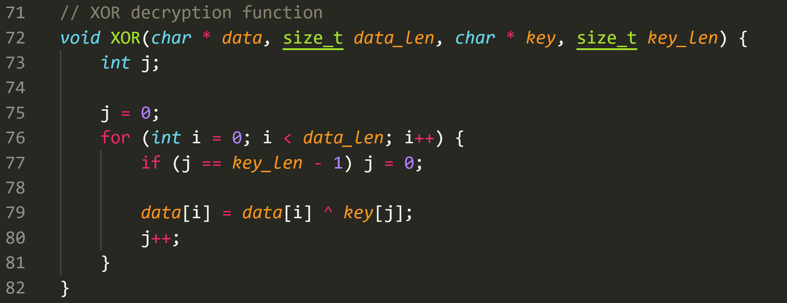

# Chapter 5: Development of a malware: implant

This chapter discusses in detail the implant component related to the development of the malware, object of this thesis.

## 5.1 The choice of payload (shellcode)

The malware design begins with the choice of payload that meets our requirements. Based on this choice, the implant is built and refined, so that everything is functional and invisible to AV software.

In our case, with a view to code reuse, we opted for the payloads already available in the Metasploit framework. Specifically, the choice fell between two types of shells, namely simple shells and meterpreter shells. Below we list the shells considered during the design, reporting pros and cons for each:

* **"windows/x64/meterpreter/reverse_tcp";** this is the best known and most used shellcode; perhaps, in some cases, even overused. We could not fail to consider it in our project and, in fact, it was then our final choice. This shellcode, as the final name of the path suggests, is a meterpreter shell, written for 64-bit Windows architectures. It is formed by two stages, namely, a small piece of code that acts as a dropper and a second fragment in assembly that constitutes the actual shellcode. Unlike a normal shell, the meterpreter shell has pre-coded functions that help the operator in their work; it is no coincidence that this type of shellcode is called "shellcode with steroids."
* **"windows/x64/shell/reverse_tcp";** this is a very simple reverse shell that uses TCP sockets for communication. It has no particular properties other than being so minimal that it is difficult for antivirus software to block; in fact, if a program were blocked just because it uses TCP sockets, most of the software on the machine would stop working.
* **"windows/meterpreter/reverse_https";** this is a meterpreter shell that, unlike the one already discussed, uses the HTTPS protocol for communication between the client and the C&C server. This feature helps the malware not to be detected, because it arouses less suspicion than the classic communication on TCP sockets.
* **"python/shell_reverse_tcp";** this is the Python variant of the simple shell discussed earlier. The advantage of this type of shell is the fact that, in a very simple and fast way, we can extend its functionalities, coding new ones in Python. Obviously, then, the payload will have to be compiled (using one of the various tools for translating and compiling Python codes¹) in order to be executed even on machines without the Python interpreter. If you opt for such a shell, it is not necessary to use the implant; in fact, the final file is already an .exe file itself, which can be executed without any problems. This solution was abandoned relatively early due to the enormous size of the file resulting from the compilation (Figure 5.1). Such a large amount of data would arouse the victim's suspicion during the download; however, the results obtained during prototyping showed that, given the simplicity of the shell, it manages to bypass security controls.

**Figure 5.1. Size of the executable file generated by compiling the Python shell with pyinstaller.**

¹ https://www.pyinstaller.org/

## 5.2 Attack mode

The path that our malware, specifically the implant, takes to complete the attack is as follows (Figure 5.2):

1.  **Copies itself to a secure location;** during this phase, the malware performs a first task, preparatory to the persistence step, in which it creates a copy of itself within a secure path of the file system. The objective is to hide the implant, i.e., the malware, in a portion of the memory where it does not arouse suspicion, in order to subsequently call it through persistence routines.
2.  **Retrieves the shellcode;** during this phase, the malware decrypts the shellcode, previously embedded as a resource in the executable file. This step is mandatory, as the shellcode, as already extensively explained, must be encrypted, or at least obfuscated, so as not to be discovered by AV software. The decryption, then, reconstructs the functional shellcode, ready to be injected into the target process.
3.  **Allocates memory for the shellcode;** during this phase, the malware reserves a portion of RAM (through the use of `VirtualAlloc()`) into which it transcribes the just retrieved shellcode.
4.  **Performs shellcode migration;** during this phase, the malware finds the host process in which to insert the shellcode and injects the latter into it.
5.  **Activates the shellcode;** during this phase, the malware creates a new thread that executes the shellcode in the memory space of the host process.
6.  **Deletes the executable;** during this phase, the malware deletes itself, replacing itself with a legitimate file, in our case an Excel file bearing the same name.

**Figure 5.2. The steps taken by the implant to activate the shellcode.**

```mermaid
graph TD
    A[copies itself to a dark location <br> IMPLANT with SHELLCODE] --> B[retrieves the shellcode <br> SHELLCODE];
    B --> C[decrypts the shellcode <br> SHELLCODE];
    C --> D[injects the shellcode into a host process <br> EXPLORER with SHELLCODE];
    D --> E[executes the shellcode <br> connects to SERVER C&C];

%% Styling (optional, for better readability if rendered)
    style A fill:#f9f,stroke:#333,stroke-width:2px
    style B fill:#ccf,stroke:#333,stroke-width:2px
    style C fill:#cdf,stroke:#333,stroke-width:2px
    style D fill:#fca,stroke:#333,stroke-width:2px
```

## 5.3 Obfuscation techniques

In this section, we illustrate the obfuscation techniques used by the implant both to hide the payload and to perform the migration.

### 5.3.1 Encryption of function calls

One of the most significant alarm bells for antivirus software is precisely the function calls made by the program. The calls made by a software constitute, in some way, a sort of unique signature capable, therefore, of detecting any malicious programs. During the static analysis of the malware, the AV software checks which functions are imported by it and, therefore, which actions it will have to perform during execution.

One of the simplest methods to identify malicious software is to search for certain functions within the import table. In Figure 5.3, we execute the command "dumpbin /imports" to show the list of imported functions and, through the findstr utility, search within it for the tuple consisting of the functions `VirtualAllocEx()`, `WriteProcessMemory()`, and `CreateRemoteThread()`. These functions are often executed by malicious software to instantiate the shellcode and migrate it to a more stable process; they are, therefore, a symptom of a possible illegitimate action. The program used for this test is a small example implant that shows how, without the use of obfuscation techniques, it is very easy to identify malware.

**Figure 5.3. Suspicious functions within the import table.**

The program in question, in fact, does not pose problems for antivirus software, which detects it in a few moments. If, however, we proceed to obfuscate the import of the aforementioned functions through a simple XOR encryption (Figure 5.4), we obtain an equivalent software whose import table, this time, does not show the three incriminating functions (Figure 5.5), thus escaping a simple static analysis.

**Figure 5.4. Simple XOR encryption of suspicious Windows APIs.**

This small gesture makes the antivirus's life a bit more difficult; however, dynamic analysis would foil our trick.

**Figure 5.5. After encryption, the incriminating functions are no longer visible in the import table.**

### 5.3.2 Payload encryption

Every implant, regardless of the technology it uses, cannot avoid encrypting the shellcode. In fact, both static and dynamic analysis would immediately reveal the presence of a known payload within an executable file, regardless of the position in which we inserted it (in our case, it was embedded as a resource). For our project, we decided, as already mentioned at the beginning of this chapter, to rely on the Metasploit framework for the production of the shellcode; therefore, our shell is more than known to all antivirus vendors. Payload encryption, in these cases, is mandatory.

In this thesis work, the chosen technique is based on the XOR operation (Figure 5.6). The reason is that it can be implemented with a rather short function, written directly by us, and at the same time offer an acceptable degree of obfuscation of the message (the payload). More complex encryption techniques would have required the use of Windows APIs, which would have further attracted the attention of AVs.

**Figure 5.6. "Homemade" function for encrypting the payload and function names.**

The key with which the shellcode is encrypted is generated automatically and inserted into the implant; this allows the implant itself to decrypt the payload at runtime. This stratagem ensures that the implant is never identical to itself, preventing the antivirus from recognizing it (Figures 5.7 and 5.8).

**Figure 5.7. Python code for the automatic, run-time generation of the XOR key to encrypt the payload to be inserted into the implant.**

**Figure 5.8. Automatically generated XOR key inserted into a .cpp file, then included in the implant.**

The result of this operation is summarized in Figures 5.9 and 5.10, where the memory containing the shellcode is shown. The latter is, at first, encrypted and unrecognizable; subsequently, after decryption, it appears in cleartext and, therefore, executable. Figure 5.11 shows the binary code (ASCII encoded) of the shellcode in cleartext for comparison with the disassembler data.

**Figure 5.9. Dump of the memory portion containing the still encrypted shellcode.**

**Figure 5.10. Dump of the shellcode after decryption.**

**Figure 5.11. ASCII dump of the shellcode in cleartext.**
