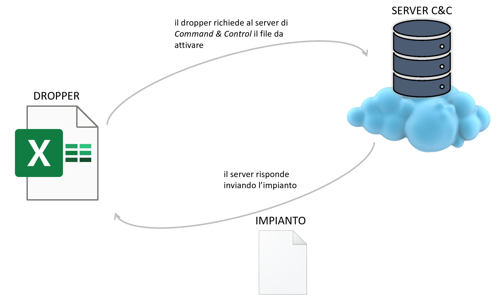
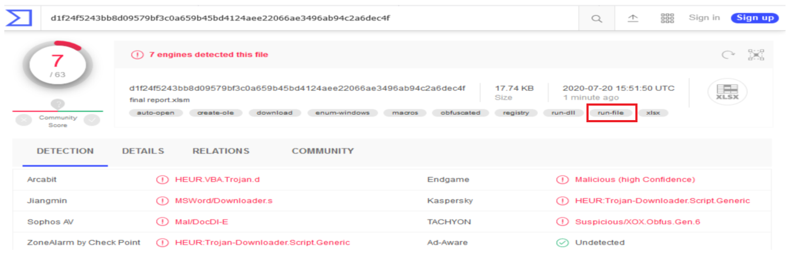
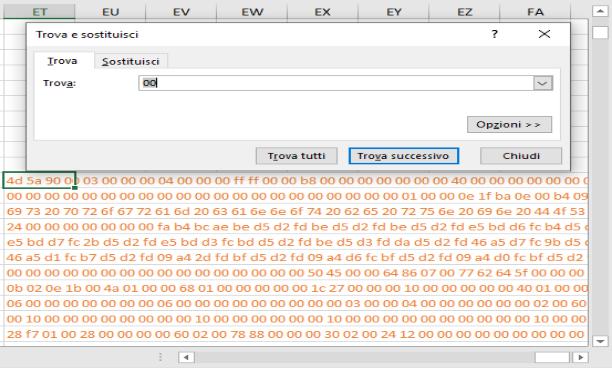
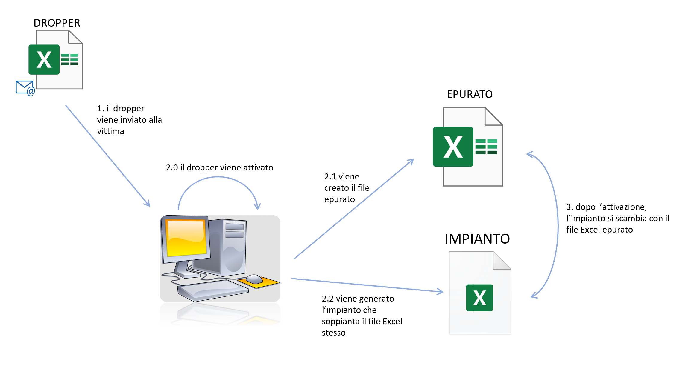

# Chapter 6: Development of a malware: dropper

This chapter illustrates in detail the techniques used for the construction of the dropper employed by our malware.

## 6.1 The choice to embed the implant

A dropper is a file that, unknowingly, downloads and executes a malicious program, the implant, on the target machine. To accomplish this, the most widely used technique is the "two-stage" approach. With this technique, system routines are exploited to download and subsequently execute the chosen malicious file (Figure 6.1).

**Figure 6.1. Working mode of a generic dropper.**

Thanks to the improvements made to antivirus systems, however, most malware are detected immediately. This happens by analyzing the function calls made by the program, specifically those related to download routines. In Figure 6.2, we show the result, obtained through VirusTotal, of scanning a simple dropper to illustrate the sensitivity of detection products to download routines (Figure 6.3).

**Figure 6.2. VirusTotal labels the malicious file because of the UrlDownloadToFileA function.**

**Figure 6.3. The incriminating part of the dropper.**

If we remove the aforementioned download functions, then the file passes the test and is not detected by VirusTotal (Figure 6.4). Other more complex attempts using PowerShell or cmd commands, unfortunately, did not yield better results (Figures 6.5 and 6.6). These attempts were necessary to identify the functions that alarmed the antiviruses and, therefore, to find an alternative to replace them. The results of these experiments are summarized in Figure 6.7.

**Figure 6.4. The file is not detected by the AV software made available by VirusTotal.**

**Figure 6.5. VBScript code for executing a batch file via cmd.exe.**

**Figure 6.6. VirusTotal immediately identifies the execution of batch commands within the file.**

**Figure 6.7. VBScript functions that generate an alert.**

In light of what is highlighted in this figure, to implement our dropper we chose to use an uncommon, but no less effective, technique to import the implant onto the target. What we did was to insert, directly into our Office file, the malicious executable encoded in hexadecimal. As a result of this operation, we obtained an Excel file containing both our implant and minimal macros useful for converting the payload from hexadecimal to binary, i.e., into an executable (Figure 6.8).

**Figure 6.8. The encoded implant inserted into the Excel file.**

The dropper, however, is not yet completely invisible to antivirus software; in fact, to activate the implant, it is necessary to call the command prompt which, as seen previously (Figure 6.7), alarms detection software. To overcome this, we devised another method that, by exploiting social engineering, leads the user to activate the malware themselves. This technique will be presented in the next section.

## 6.2 Attack mode

The entire logic of the dropper is encoded through the use of macros. The main function, namely the activation of the implant, is masked by other subroutines that have secondary tasks, such as, for example, deleting traces, printing error messages, and more. Below we describe step by step what our dropper does once started by the user, including how it manages to circumvent restrictions on the use of the shell (Figure 6.9).

1.  **Random restart.** A subroutine, with a 30% probability, closes the sheet as soon as it is opened, also reporting a generic error that invites the user to restart the application. The objective of this subroutine is to generate dynamic, random behavior that confuses analysis software.
2.  **Creation of the executable file.** The hexadecimal content of the sheet is translated into binary and written to a text file (.txt) in the current folder.
3.  **Change of extension.** The newly created text file is renamed by changing the extension from .txt to .exe. This action effectively makes it an executable. The operation, apparently useless, is fundamental for not alarming the antivirus with the creation of an executable file; in fact, what we did was only create a text file and rename it.
4.  **Creation of the purged file.** An Excel file identical to the current dropper is created, but without macros; then, the latter is saved in a hidden location (`C:\Users\Public`).
5.  **Disabling extensions.** Extensions are disabled so that it is no longer possible to distinguish the executable file (.exe) from the dropper (.xls).
6.  **Closing the document.** A message box informs the user that Excel has been updated, so it is necessary to restart it to continue working. As soon as the message is shown, the Excel sheet is automatically closed.
7.  **Deleting traces.** The Excel file, at this point, deletes itself from the disk, leaving in its place only the executable file (implant) without an extension, therefore indistinguishable from the just-deleted Excel file. It will then be the user who, in an attempt to reopen the just-deleted Excel file, will activate the implant with a double click.

**Figure 6.9. The sequence of steps taken by the dropper to infect the system.**

The result of this series of steps performed by the dropper is the importation of the implant onto the target machine and the creation of the purged copy of the Excel file. Now, it is the implant's task to do the rest. The task of starting the implant is left to the user themself; in fact, in the same position where the dropper was previously located, we now have our implant with the same name and the same icon as the old Excel file. The user, based on what was previously reported by the message box, will restart the Excel file that closed and, unknowingly, instead of activating the real Office file, will click on our implant.

Now, once the implant has started, it performs a series of steps, already detailed in Chapter 5. These are:

1.  **Duplication.** A necessary step to be able to manage persistence and on which we will return in subsequent chapters.
2.  **Starting the shellcode.** The implant retrieves, decrypts, and starts the shellcode.
3.  **Swap with the purged Excel file.** The executable swaps with the purged Excel file (devoid of any malicious code), so that, on the one hand, it erases the traces of the infection, and on the other, it prevents the implant from starting over and over again if the user were to click on it again.

At this point, our malware is running on the victim machine, but, at any moment, it could be terminated, for example, if the computer were turned off. Therefore, in the next chapter, we will discuss persistence techniques, which will allow our program to take root on the infected system.