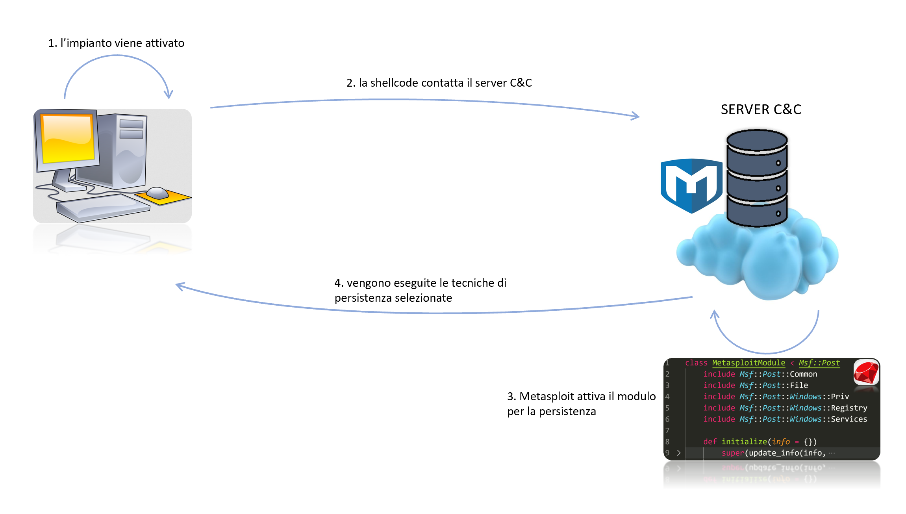

# Chapter 7: Development of a malware: persistence

This chapter reports the persistence techniques used to make our malware permanent, or almost permanent, on the target's machine.

## 7.1 The template used

As anticipated at the end of the previous chapter, our "attack" concludes with the persistence phase, which is the step where we implement a series of actions to maintain access to the infected machine, trying to prevent our malware from being discovered or, even worse, completely deleted.

For this part, always with a view to code reuse and modularity, we availed ourselves of the Metasploit framework and the `persistence_exe.rb` module, which Metasploit itself makes available. The aforementioned module, available only for Meterpreter sessions on Windows, essentially performs two modes of persistence, one at the user level (low level) and the other at the admin level (high level). The technique exploited by the module for persistence is writing to registries, an operation as simple as it is effective. Unfortunately, however, this method is also known to detection software, which is therefore able to detect and block it immediately.

In our thesis project, we used the `persistence_exe.rb` script as a template to start from and then added other persistence techniques, which are less known and, therefore, more effective. The user, at run-time, can choose which actions to implement based on the scenario in which they will operate, such as, for example, the type of persistence (low or high), the techniques to implement it (writing to registries, creating tasks, etc.) and more (Figure 7.1).

**Figure 7.1. The parameters of the Metasploit module developed for the persistence phase.**

The benefit of relying on the Metasploit framework lies, above all, in the possibility of exploiting its handler, specifically the switch for the automatic startup of post-exploitation scripts. This particularity made us lean towards the development of a plugin written in Ruby, to be integrated within the framework rather than an external script. The final result is, therefore, a module capable of starting automatically as soon as the session is established and which, with a series of successive actions, is able to fix the malware on the target machine (Figure 7.2).

**Figure 7.2. The steps that the different actors take during the persistence phase.**

In the next sections, we illustrate some of these techniques, particularly the most interesting ones, dividing them based on the level of persistence they manage to achieve.

## 7.2 "Low level" persistence techniques

The expression "low level persistence techniques" refers to those actions aimed at guaranteeing a minimum level of permanence on the system, which do not require particular privileges to be executed. We are therefore referring to techniques that are simple to apply and not particularly effective.

The "low level" persistence techniques implemented in our module are divided into different categories. These classes are determined based on the actions performed by the module; the latter are reported below:

* **Writing to registries.** The registries "HKEY_CURRENT_USER\Software\Microsoft\Windows\CurrentVersion\Run" and "HKEY_CURRENT_USER\Control Panel\Desktop" are written, which are responsible for launching the first applications immediately after the machine is turned on (Figure 7.3).
* **Modification of the PowerShell profile.** An additional command is added to the PowerShell profile file. The command to add, obviously, will be a simple call to our malware (Figure 7.4).
* **Adding the implant to the Startup folder.** Our implant is added to the Startup folder, thus ensuring that the executable starts when the operating system boots.
* **Rewriting shortcuts.** The shortcuts present on the system are overwritten so that they first launch our malware and then the program for which they were created.

**Figure 7.3. The Run registry has been modified by adding a new key, whose value is precisely the path of our implant.**

**Figure 7.4. Command to start the implant added to the PowerShell profile of the user ieuser.**

For each "low level" persistence technique, the relative cleanup actions have also been implemented, i.e., those operations aimed at erasing the traces of the infection on the system. Most of these can be called automatically by the script itself; others, however, require operator intervention.

## 7.3 "Admin level" persistence techniques

When our malware manages to acquire administrator privileges, it is more convenient to exploit admin-level persistence techniques; these allow us to consolidate our shell on the attacked system more effectively than low-level ones. This guarantees that we do not have to repeat privilege escalation operations every time we reactivate our shellcode, because it is already re-executed with administrator privileges.

In our case, the "admin level" persistence techniques used are the following:

* **Modification of scheduled tasks.** Some scheduled tasks that have administrator privileges are modified, or created anew, by inserting an additional command that will activate our shellcode (Figure 7.5).
* **Writing to registries.** In this case too, we find the technique of writing to system registries; this time, however, this technique is performed on registries accessible only to the administrator. This detail guarantees us a higher level of persistence (Figure 7.6).

**Figure 7.5. New scheduled task created to start the implant at startup.**

**Figure 7.6. The Shell key of the Winlogon registry has been modified by adding the name of our implant as its value.**

In this case too, for each technique, we have implemented the relative cleanup operations.
This chapter concludes the part relating to the implementation of our malware. In the next chapter, we will summarize all the steps taken using diagrams and figures, and then move on, with Chapter 9 relating to tests, to demonstrating the effectiveness of the software produced and the potential threats it can bring to a system.