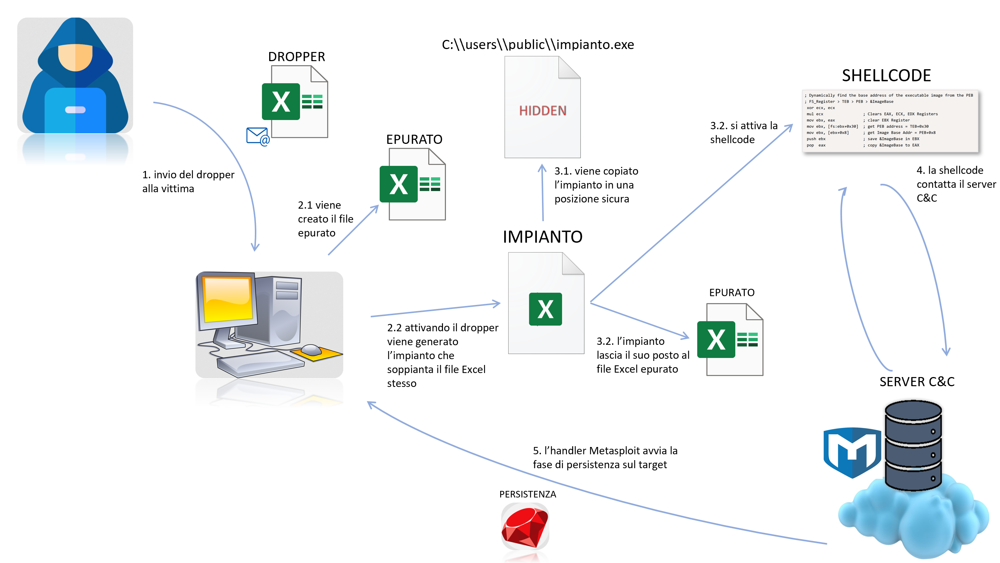
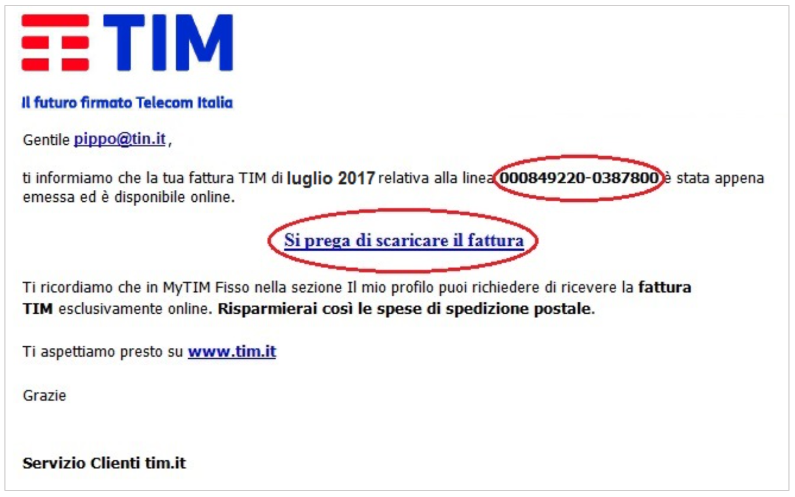

# Chapter 8: Wrap up

This chapter summarizes the steps that lead the malware to infect the system and shows some application scenarios.

## 8.1 The steps leading to system compromise

In the previous chapters, specifically in Chapters 5, 6, and 7, we described how each part of the malware operates to successfully carry out the attack. In this section, we will summarize the malware's action plan to provide the reader with a clear overview of how our software completes the attack operation. Regardless of the technologies used, it is possible to find, or at least replicate, this attack procedure in other scenarios with different operating systems, by merely adapting a few pieces of code so that they compile on the target architecture of the attack. We can, therefore, define this attack mode as a sort of standard that, more or less, is followed by any malware, with the exception of some minor code modifications.

In Figure 8.1, we observe all the various steps that our malware, with its multiple parts, performs. Below, we describe each single step:

* **Malware Delivery.** The malicious file, packaged in the dropper, is sent to the victim, usually as an email attachment.
* **Implant Reconstruction.** Activating the dropper, i.e., enabling the macros of the Excel file, creates the implant's executable; subsequently, it disables the display of file extensions; by doing so, the user can no longer distinguish the malicious application from the previous Office file (the executable's icon has also been modified to be the same as that of an Excel file). At this point, the dropper creates a file identical to itself, called a purged file because it no longer contains the malicious instructions, and places it in a temporary folder. Finally, the Excel file self-deletes, leaving in its place only the implant which now has the appearance of the dropper (name and icon).
    The Excel sheet, i.e., the original dropper, after finishing the "preparations" for the attack, shows the user a message box inviting them to restart the application due to a pending update.
* **Implant Activation.** The user, invited by the dropper to close and reactivate the Excel sheet, will click again on the Excel file which, this time, however, is not a data sheet, but an application. The user, unconsciously, has activated the implant, which, first, activates the shellcode; subsequently, it self-destructs, replacing itself with the purged Excel file previously created by the dropper. In this way, if the user were to click again on the Excel file, it will open without problems and without showing alarming content, as it is the purged Excel file, i.e., devoid of any malicious content, containing only the initial legitimate data.
* **Meterpreter Session Start.** The shellcode contacts the Command and Control server, thus activating the Meterpreter session.
* **Persistence Phase Start.** The Metasploit handler automatically, once the connection with the shellcode is established, will start the script for the persistence phase, "soldering" our implant onto the target machine.

**Figure 8.1. The complete sequence of steps that our malware performs to infect a machine.**

## 8.2 Possible usage scenarios

This approach, as mentioned earlier, is very generic and usable in different contexts, perhaps by slightly modifying the implant and the technologies used to assemble it.
In this section, we want to try to give some ideas on how this software can be used to attack a computer, perhaps in a phishing campaign.

### 8.2.1 Email scam

Surely the "delivery method" most appreciated by hackers is the one based on emails. In fact, this tool allows them to hide behind a mail server, without the need for on-site operations, and, at the same time, to target hundreds of thousands of victims with a simple script of a few lines (nowadays all major scripting languages allow fast and automatic sending of emails). It is not difficult to find one's email inbox clogged with messages written in improbable Italian, containing completely generic information not directly related to our person, inviting us to click on a link or, even worse, to download an attachment (Figure 8.2). Precisely this last example is what we kept in mind during the development of our project and which we reported in Figure 8.1.

**Figure 8.2. Typical phishing email inviting the user to download a file from the appropriate link.**

### 8.2.2 Manual replacement of a shortcut

On Windows systems, but not only, there are so-called "shortcuts," i.e., links or icons that allow the activation of a program, or the opening of a file, that is not in the current location and that, for reasons of consistency, one does not wish to duplicate (Figure 8.3).

**Figure 8.3. Icon of a shortcut on Windows 10.**

With a physical intrusion operation into the system to be attacked, it is possible to replace these shortcuts, generally easy to modify, with the malicious application, in our case only the implant. Having done this, when the operator, with the appropriate permissions, goes to call, through the compromised shortcut, the application they need, our implant will activate, but with the permissions of the operator who is using the machine at that moment (the logs will also report this latter operator as the one who performed the malicious actions). This method, perhaps one of the most subtle, has also been implemented in our persistence script, in which, however, it is executed automatically.