# Chapter 9: Tests and potential

This chapter reports the results obtained from executing our malware on two test virtual machines and also illustrates some possible attack scenarios.

## 9.1 Testing environments

Once the malware was developed, we performed some tests on two trial virtual machines to ensure that the product of our work possessed the properties set during the design phase, namely the ability not to be detected by Windows Defender and to persist on the attacked system.

The virtual machines used are, respectively, a Windows 10 Enterprise Edition system, similar to the more well-known version for domestic use Windows 10 Home Edition, and a Windows Server 2019 machine.

The first system is not perfectly up-to-date; in fact, the day we started testing our malware, we disabled automatic Windows Defender updates and, for safety, disconnected the machine from the Internet. This is a mandatory practice to prevent our malware from suddenly stopping to work due to an unwanted automatic update, which would invalidate the entire test. Currently, the virtual machine runs Version 1809 of Windows Enterprise and Version 1.321.2115.0 of Windows Defender (Figure 9.1).

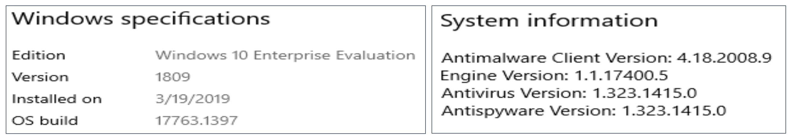
**Figure 9.1. The build and Windows Defender versions installed on Windows 10 Enterprise Edition.**

The second machine, on the other hand, is a server system, specifically the latest product from Microsoft. Having been imported into VirtualBox after the Enterprise machine, the version of Windows Defender is more up-to-date than the other machine. The build and Windows Defender versions are, respectively, 1809 and 1.323.1194.0. This machine too, immediately after being started for the first time and having performed all the necessary updates, was disconnected from the LAN to avoid any automatic updates (Figure 9.2).

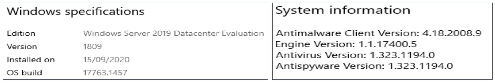
**Figure 9.2. The build and Windows Defender versions installed on Windows 2019 server.**

Although internet access is disabled for both machines, we also set the Windows Defender switches so that they do not attempt to send files to the parent company's server for further investigation into the possible malicious nature of the analyzed document (Figure 9.3). In this way, the antivirus can only use local analysis methods.

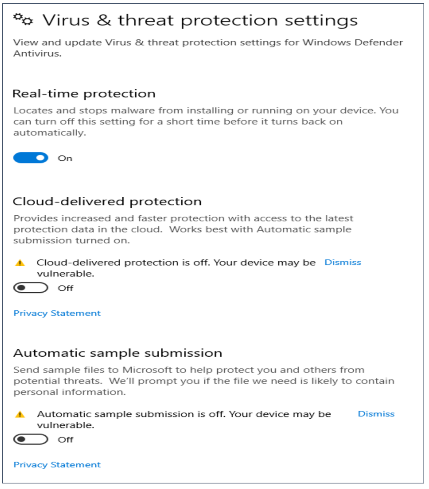
**Figure 9.3. The Windows Defender settings used during the testing phase.**

The machines were then connected to a local LAN to allow communication between them and the attacking machine. The latter, described in detail in Chapter 4, is based on Windows 10 Enterprise Edition. Communication between the machines is necessary to allow the shellcode to contact the handler on the C&C server, thus allowing the attacking machine to control the target machines.

## 9.2 Test on Windows 10 Enterprise Edition

For the test on the Enterprise machine, we chose to compose our malware using a Meterpreter reverse shell that exploits the TCP protocol for communication. In Figure 9.4, it is possible to see the step in which we select, through the command-line interface of our framework, the shellcode to use. This step, actually, can be automated by directly passing the name of the shellcode to the Python function for payload creation. This aspect allows malware to be produced in series, in a sort of mechanism similar to an "assembly line," useful when dealing with phishing campaigns.

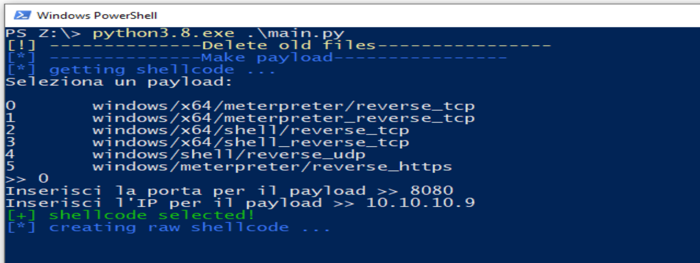
**Figure 9.4. The framework output asking us to select the shellcode with which to compose the malware.**

Once the malware is obtained, it is loaded onto the target machine. Having done that, we verify that Defender is not able to detect it (Figure 9.5); then, we open the Excel file.
Having done that, we are asked if we want to enable macros; we then press Enable Content and, without realizing it, we have just activated the malicious code.
Now, it is sufficient to press on any cell to activate the sequence of steps of our dropper; having done that, we see a message appear inviting us to restart the datasheet (Figure 9.6).
Now, however, the previously downloaded Excel file no longer exists; in its place, we find a file that, apparently, has an .xls extension; opening, however, the properties window, we can see that it is, instead, an executable file (Figure 9.7).

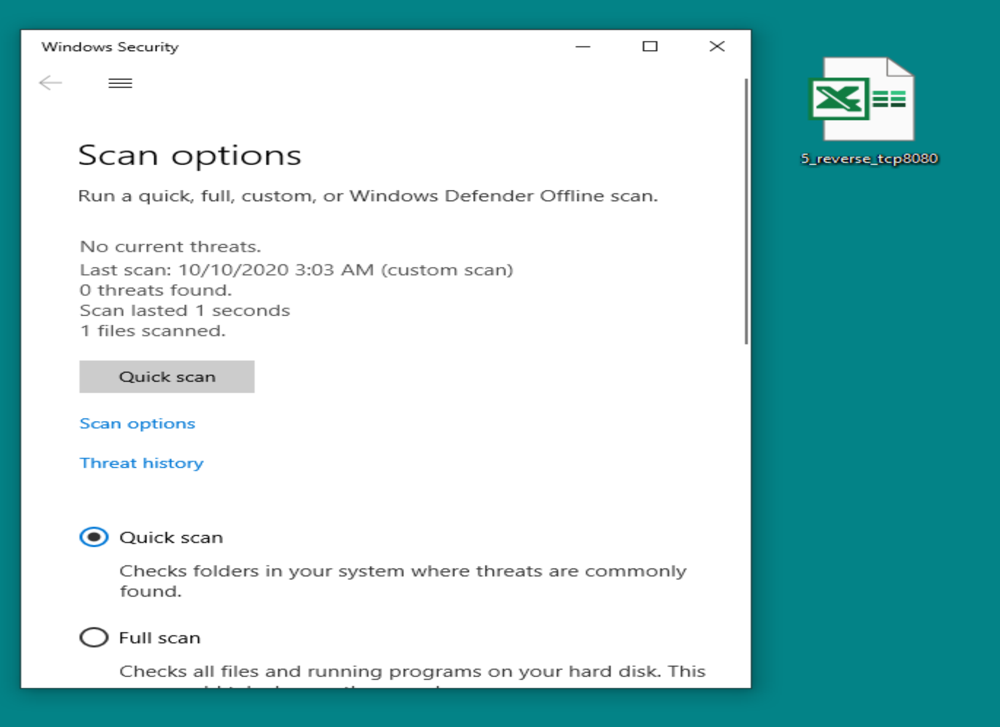
**Figure 9.5. Our dropper passes the antivirus scan unscathed.**

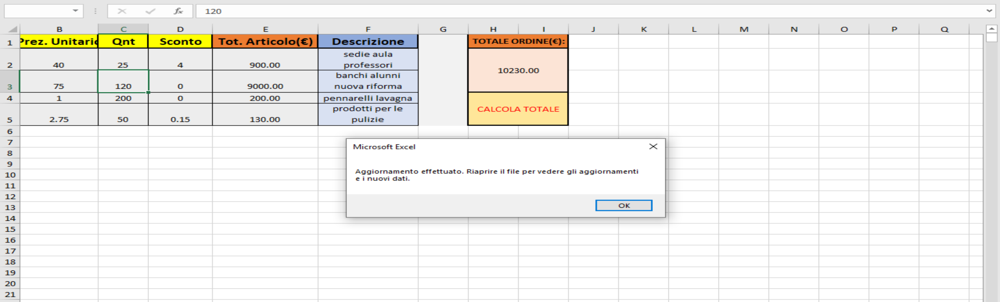
**Figure 9.6. The deceptive message inviting the user to restart the datasheet.**

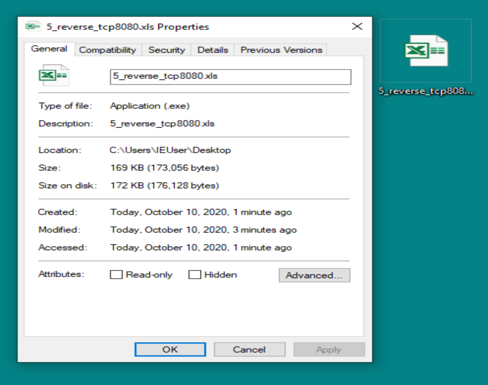
**Figure 9.7. The Properties window shows the real nature of our implant, i.e., an executable.**

The user, deceived by this swap, presses on the application, i.e., the implant, and activates the shellcode within it.
Now that the Meterpreter session is active, our handler proceeds to perform the persistence phase (Figure 9.8) and, at the same time, the implant self-destructs, replacing itself with a purged copy of the previous Excel file.

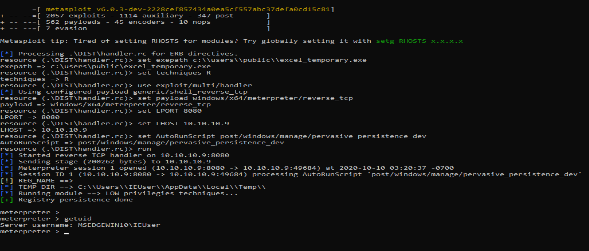
**Figure 9.8. Opening of the Meterpreter session with consequent activation of the persistence plugin.**

## 9.3 Test on Windows Server 2019

In this section, we delve into the effectiveness of our malware on a system that is a bit more complex than the previous one, namely a server system.
In this case, we choose to use both the previous shellcode (Meterpreter reverse shell in TCP) and a UDP reverse shell. We anticipate, in fact, that the first one will not be able to penetrate the system's defenses; at that point, we will try to see if, instead, the use of a more minimal and, at the same time, less powerful shell, can bypass the antivirus software and grant us access to the machine.

In Figure 9.9, we report the creation of the second malware, this time, consisting of a simple UDP shell.
We import both newly generated files onto the target system, i.e., the malware with the Meterpreter shellcode and the one with the UDP shell.
We launch the first dropper with the Meterpreter shell, but this is promptly blocked by Defender, which detects a malicious file; it is, precisely, the newly generated implant (Figure 9.10).

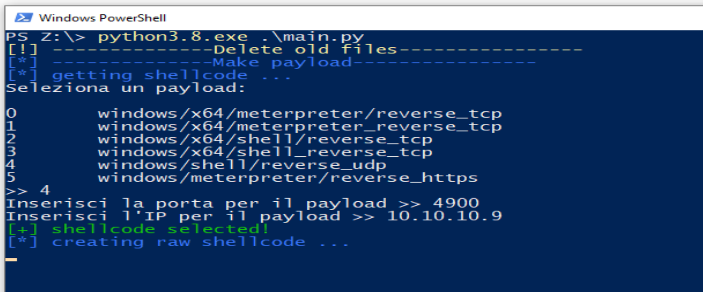
**Figure 9.9. Creation of the shellcode based on the UDP protocol.**

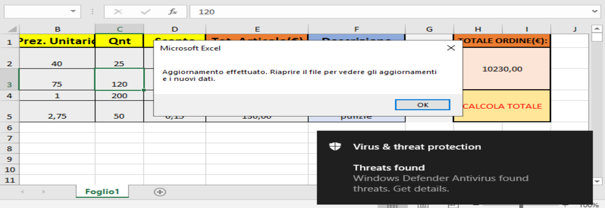
**Figure 9.10. Defender promptly blocks the implant as soon as it is generated.**

The second malware also fails, but without Defender being activated. We realize, in fact, that the UDP shell does not activate correctly, but, on the contrary, causes the sudden closure of explorer (software for window management). This fact makes us understand that the shellcode is not incorporated correctly into the malware during its creation by the framework; therefore, during activation, it will crash (or, as they say in jargon, "crasha") and, with it, also the process onto which it had migrated, namely explorer. It is probably an error due to so-called "bad chars"; this leads us to conclude that the framework's automatic procedure is not suitable for all types of shellcode, but that it needs to be reviewed and made customizable based on the shell chosen by the user.

## 9.4 Attack scenarios

Below we will illustrate some particular scenarios in which our malware can be employed. We will also show some features of the Meterpreter shell that can be exploited during a red team operation or a penetration test and that, if used for malicious purposes, can cause serious damage to the company and its business.

### 9.4.1 Credential theft

A rather common operation when attacking a system is the theft of access credentials relating to different users, mostly privileged ones. This action is easily achievable thanks to the capabilities of the Meterpreter shell, which integrates the `hashdump` command for printing system hashes to the screen (Figure 9.11).

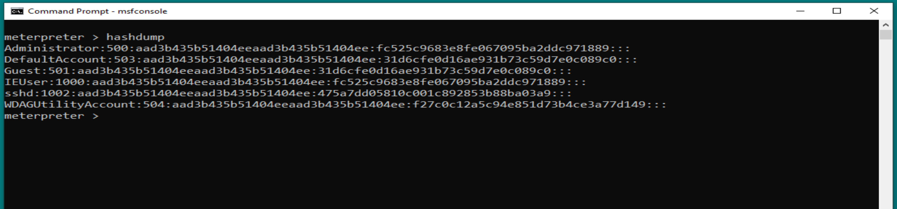
**Figure 9.11. Execution of hashdump on the target machine.**

To be able to use this functionality, however, we must possess administrator privileges; therefore, it is necessary to perform a privilege escalation technique or exploit social engineering to lead the user, i.e., the admin, to activate our implant.
Once the system hashes are obtained, one can attempt to decrypt them using bruteforcing techniques; through tools such as, for example, hashcat or john the ripper.
At the end of the operation, we can clean up the traces left on the system using the `clearev` command, also integrated into the Meterpreter shell (Figure 9.12).

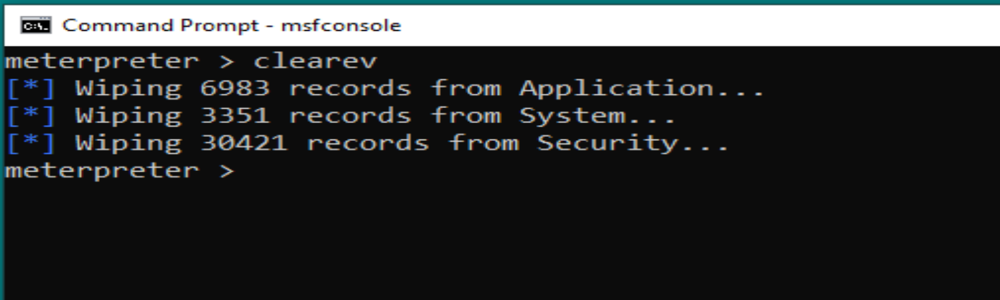
**Figure 9.12. Execution of clearev on the target machine to erase traces of the attack.**

### 9.4.2 Keylogger

Another method to steal credentials and passwords consists in using Meterpreter's keylogger.
A keylogger, in computer science, is a software tool capable of sniffing the keyboard of a computer, i.e., secretly intercepting and capturing everything that is typed on the keyboard without the user realizing they are being monitored. In the specific case of Meterpreter's keylogger, the program is injected directly by the shellcode through the `keyscan_start` command, typed on the Metasploit console.
The result is shown in Figure 9.13, where we can see on the screen what the user typed in the time frame in which our keylogger remained active.

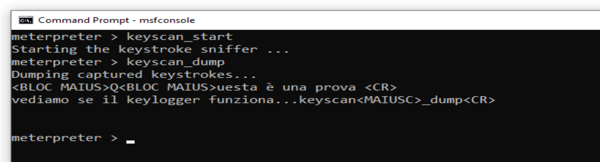
**Figure 9.13. Execution of the keyscan_start command on the target machine.**

This tool could prove successful in all those contexts where, for example, we do not have the necessary authorizations to access the hash file, or, when, once the hashes are obtained, we are unable to decrypt them.

### 9.4.3 Download of sensitive resources

One of the most common tasks during a test is downloading. Meterpreter provides a specific command (`download`) to facilitate the operator in this task. This command is widely used during the exfiltration phase, to bring sensitive data, i.e., sensitive data, out of the corporate perimeter.
Generally, one proceeds as follows: the most interesting data (passwords, configuration files, datasheets, etc.) are searched for using Meterpreter's `search` command (Figure 9.14); subsequently, they are downloaded using the `download` command.

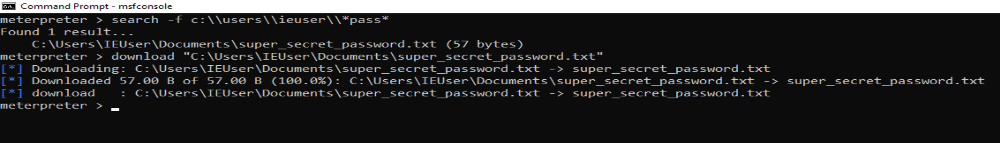
**Figure 9.14. Execution of the search and download commands to search for and subsequently download a sensitive document.**

With these two simple steps, considerable damage can be caused to the company if the exfiltrated data are patents or, more generally, if they concern valuable know-how for the business's activity.