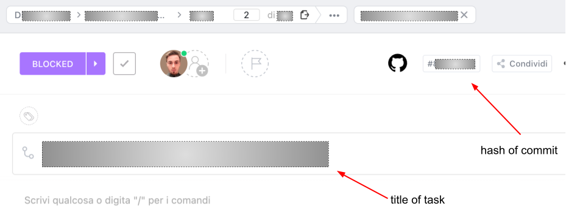

# GitHub Repo Guidelines

## 1. Naming Convention

### 1.1. Types (Branch/Commit)

| **build** | This covers code and artifacts related to build operations. This could be building a Docker container or compiling code (though this isn't applicable for pure Python projects). |
| --- | --- |
| **ci** | This includes content related to continuous integration and continuous delivery. |
| **docs** | All changes related to documentation, including docstrings, fall under this type. |
| **style** | This is for formatting changes that don't alter code logic, like adding white lines, spaces, etc. It's all about style, not code refactoring. |
| **refactor** | This involves actual code refactoring. It’s not just about moving lines of code around; it’s about rewriting a class, function, or other code elements to make them more readable and aligned with good design patterns. |
| **perf** | Any modifications aimed at improving the code's performance belong here. |
| **test** | This type is for any code added that's related to tests. |
| **chore** | This is for everything else that doesn't fit neatly into the categories above. |

### 1.2. Branch

For branches, please use the following naming structure:

`<category>/<reference>/<description-in-kebab-case>`

Where:

- `category`: This should be one of the types listed in the table above.
- `reference`: This is an identification code for the specific activity or task. It corresponds to the task code assigned by ClickUp (see image 1).
- `description-in-kebab-case`: This is a descriptive name for the task you're working on, written in kebab-case (it could be the task title from ClickUp).

---

[Branch naming convention source](https://dev.to/varbsan/a-simplified-convention-for-naming-branches-and-commits-in-git-il4#:~:text=Branch%20Naming%20Convention&text=A%20git%20branch%20should%20start,bugfix%20%2C%20hotfix%20%2C%20or%20test%20.&text=After%20the%20category%2C%20there%20should,%2C%20just%20add%20no%2Dref%20)

 
 

### 1.3. Commit

For commit titles, use this format:

`<category>: Description`

Where:

- `category`: This is the type of commit (use one of the types from table 1).
- `Description`: This is a clear description of what was done.

Follow these rules for the description:

- Start the sentence with a verb in the present imperative form that describes the main action taken (e.g., Add, Modify, …).
- Verbs should be in the present imperative form.
- The description should preferably not exceed 50 characters.
- The description should not end with a period (“.”), but it can (though it's better not to) contain semicolons (“;”) to indicate multiple changes within the same commit (e.g., Add new parameter…; Modify max threshold…).

---
[Commit naming convention source](https://www.conventionalcommits.org/en/v1.0.0/#summary)

 
 

## 2. Repository Structure

The repository is structured as follows:

When you need to develop a feature or, more generally, work on the code, you should create a branch from `dev`. You can directly create a branch from one of the more long-lived permanent branches (like `master` or `stage`) when you need to make a quick and simple hotfix.

The three persistent branches mirror the structure of the Prefect environments (prod, stage, dev).

## 3. New Task

When you need to work on the code, follow these steps:

1. Create the relevant task for the work to be done in ClickUp.
2. Create a new branch from `dev` and name it according to the conventions described above.
3. Make your code changes, committing them as you go.
4. Push your commits to the newly created branch.
5. If necessary, hand off the work (notify them) to whoever needs to take over next (e.g., frontend development, …). Otherwise, merge your completed work into `dev`. If there’s a chance of conflicts, it’s advisable to avoid a direct merge and instead create a pull request to `dev`. Then, you can take your time to resolve any conflicts directly within the pull request.