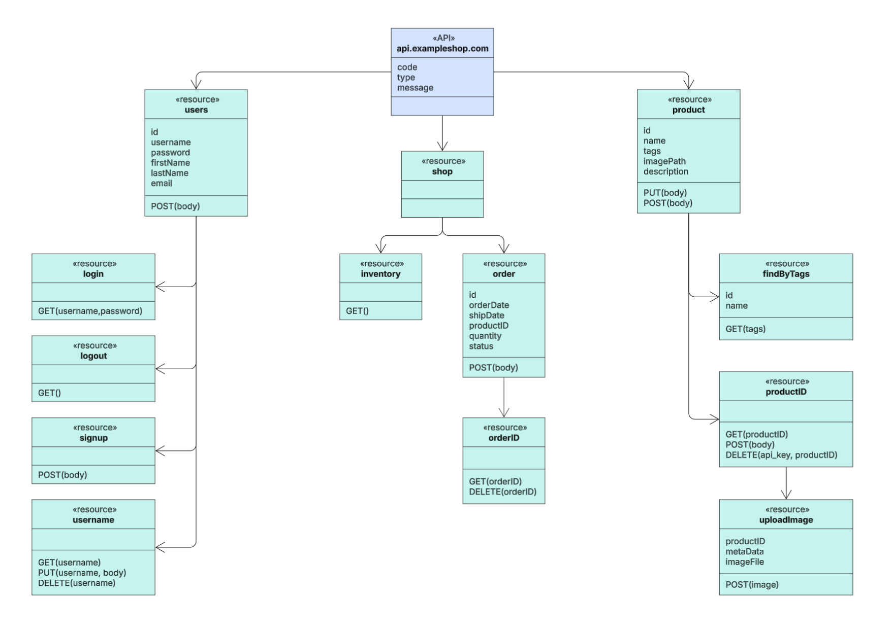

# Start a new FastAPI project

First, let's create the project structure:

```bash
my_fastapi_project/
│
├── app/                      # Main folder for the application's source code
│   │
│   ├── __init__.py           # Makes 'app' a Python package
│   │
│   ├── main.py               # Main entry point: FastAPI instance creation, middleware, router inclusion
│   │
│   ├── db/                   # Module for database interaction ('database')
│   │   ├── __init__.py
│   │   ├── session.py        # SQLAlchemy/SQLModel engine setup, SessionLocal, get_db dependency
│   │   └── utils.py          # (Optional) DB-specific utility functions
│   │
│   │
│   ├── datamodel/              # SQLModel models (Pydantic + SQLAlchemy) for API data validation (input/output) and serialization
│   │   ├── __init__.py
│   │   ├── item.py           # Pydantic schemas for 'Item' (ItemCreate, ItemUpdate, ItemRead, etc.)
│   │   ├── user.py           # Pydantic schemas for 'User'
│   │   └── token.py          # (Example) Schemas for JWT tokens
│   │
│   ├── api/                  # Module containing API routers (endpoints)
│   │   ├── __init__.py
│   │   ├── common.py           # Reusable dependencies (e.g., get_db, get_current_user)
|		|		├── auth/               # routes for authentication
|   |   |   └── __init__.py
|   |   |   └── login.py        # login endpoint
|   |   |   └── utils.py        # various utilities for login
│   │   └── v1/                 # (Optional) API versioning
│   │       ├── __init__.py
│   │       ├── endpoints/      # Folder with files for individual endpoints/resources
│   │       │   ├── __init__.py
│   │       │   ├── items.py    # Endpoints related to 'Item'
│   │       │   └── users.py    # Endpoints related to 'User'
│   │       └── api.py        # Main router that aggregates v1 endpoints
│   │
│   ├── services/             # (Optional but recommended) Business logic that orchestrates CRUD calls and other logic
│   │   ├── __init__.py
│   │   ├── items_service.py
│   │   └── users_service.py
│   │
│   └── utils/                # (Optional) Generic utility functions not specific to a module
│       ├── __init__.py
│       └── helpers.py
│
├── tests/                    # Folder containing all tests ('tests')
│   ├── __init__.py
│   ├── conftest.py           # Pytest fixtures (e.g., test client, DB dependency overrides)
│   ├── test_main.py          # Tests for basic functionality in main.py (e.g., health check)
│   ├── api/                  # Tests mirroring the 'app/api/' structure
│   │   ├── __init__.py
│   │   └── v1/
│   │       ├── __init__.py
│   │       └── endpoints/
│   │           ├── __init__.py
│   │           └── test_items.py
│   │           └── test_users.py
│   ├── **security**/             # Security tests (also related to endpoints/api), the Sec part of the DevSecOps pipeline
│   ├── datamodel/              # Tests for Pydantic schema validation
│   │   └── test_item_datamodel.py
│   └── utils/                # Tests for utility functions
│
├── .env                      # Environment variables (ADD TO .gitignore!)
├── .env.example              # Example .env file
├── .gitignore                # Files and folders to ignore for Git
├── Dockerfile                # (Optional) For containerizing the application
├── pyproject.toml            # (Alternative/Addition to requirements.txt) For managing dependencies and builds with Poetry, PDM, etc.
└── README.md                 # Project description, setup, and execution instructions
```

Now, for each class in the previously obtained diagram:



Next, for each identified route, we'll construct the tuple (route, input, output) like so:

  - Create the function prototype that will handle the route:


```jsx
@app.post("/api/v1/order")
def append_order_to_client(order: Order, client: ClientDetail) -> Order:
	pass
```

Once that's done, we'll define the input and output for the function we just declared:

  - Order
  - ClientDetail
  - Order (the same as before; in this case, it's also the function's output)

To do this practically, an optimal solution could be to use a Python 3 package called `sqlmodel`. It merges Pydantic and SQLAlchemy, allowing us to define this interface object just once and use it for both API data validation and writing to the database.

## Quick Start with SQLModel: Validation and Database Writing

Here's a simple and practical example to get started using SQLModel with FastAPI for validating data and writing it to a database.

### 1\. Installing SQLModel

Make sure you have SQLModel installed in your project:

```bash
pip install sqlmodel
```

### 2\. Creating the SQLModel Model

With SQLModel, you can define a model that serves as both a validation schema (Pydantic) and an ORM model (SQLAlchemy):

```python
from sqlmodel import SQLModel, Field
from typing import Optional

class Item(SQLModel, table=True):  # `table=True` indicates it's a table model for the DB
    id: Optional[int] = Field(default=None, primary_key=True)
    name: str = Field(index=True)
    description: Optional[str] = Field(default=None)
    price: float
```

Basically, this package is very similar to Pydantic, but it also lets us define SQLAlchemy-typical directives in the model. For example, we can specify the length of string fields (`max_length=50`, just like in pure Pydantic), or which field is the primary key, which field to index, and so on.

### 3\. Database Configuration

Create a database connection and configure the session:

```python
from sqlmodel import create_engine, Session

DATABASE_URL = "sqlite:///./test.db"  # You can also use other databases (PostgreSQL, MySQL, etc.)
engine = create_engine(DATABASE_URL, echo=True)

def create_db_and_tables():
    SQLModel.metadata.create_all(engine)

def get_session():
    with Session(engine) as session:
        yield session
```

### 4\. Endpoint to Create a Record

Create a FastAPI endpoint to validate incoming data and save a record to the database:

```python
from fastapi import FastAPI, Depends
from sqlmodel import Session

app = FastAPI()

@app.post("/items/", response_model=Item)
def create_item(item: Item, session: Session = Depends(get_session)):
    session.add(item)  # Adds the object to the session
    session.commit()  # Saves changes to the database
    session.refresh(item)  # Updates the object with DB data (e.g., generated ID)
    return item
```

### 5\. Example Usage

Launch the app:

```bash
uvicorn main:app --reload
```

And try sending a POST request to `/items/` with a JSON body like this:

```json
{
    "name": "Laptop",
    "description": "A latest generation laptop",
    "price": 1200.50
}
```

### 6\. Reading Data from the Database

You can create an endpoint to read data from the database:

```python
@app.get("/items/", response_model=list[Item])
def read_items(session: Session = Depends(get_session)):
    items = session.query(Item).all()  # Retrieves all Item objects from the DB
    return items
```

### 7\. Creating the Database

Don't forget to call the `create_db_and_tables()` function to create the database and tables before starting the application:

```python
if __name__ == "__main__":
    create_db_and_tables()
```

### Conclusion

With SQLModel, you can easily combine data validation and database interaction into a single model, reducing duplicate code and simplifying development. This approach is particularly useful for FastAPI-based applications.

# Test-Driven Development

Before starting to write the routes, it would be good practice to define the corresponding test. That is, if we want to create a GET request that returns a JSON object containing "id" and "username" fields, we'll create the relevant test. This test will verify that calling this (not yet implemented) function actually returns a dictionary (JSON) with the aforementioned fields, and with values within a plausible range or as specified in the requirements. Once the test is implemented (we obviously don't run it yet), we'll proceed to write the corresponding REST API. After doing that, and before moving on to other APIs, we'll run the previously written test. If it passes, then we can continue.

This procedure might seem trivial and obvious, but it's good to follow it – make an effort to do so. Writing the very first API will likely bring up several doubts and implementation, configuration, and database interfacing errors. If these are corrected immediately, it will allow us to be faster when writing subsequent APIs.

Okay, let's design a small part of a REST API for managing "Products" in a store using an approach inspired by Test-Driven Development (**TDD**). TDD applied to APIs focuses on writing tests first (which define how the API should behave from the client's perspective) and then implementing the bare minimum to make those tests pass.

**Scenario:** We want to implement the endpoint to create a new Product.

  - **Endpoint:** `POST /products`
  - **Input (Request Body):** JSON with `name` (string, required), `description` (string, optional), `price` (float, required, \> 0).
  - **Output (Success):** Status `201 Created`, JSON with the created product's data, including a server-generated `id`.
  - **Output (Error):** Status `422 Unprocessable Entity` if the input data is invalid.

**Assumed Tools:**

  - FastAPI
  - `pytest` as the test runner
  - `httpx` for making HTTP requests in tests

**Folder Structure (simplified):**

```jsx
project/
├── app/
│   ├── __init__.py
│   ├── main.py         # Main FastAPI instance
│   ├── schemas.py      # Pydantic schemas
│   ├── models.py       # ORM models (SQLAlchemy/SQLModel)
│   ├── crud.py         # CRUD functions
│   ├── api.py          # API router
│   └── db.py           # DB session setup
├── tests/
│   ├── __init__.py
│   ├── conftest.py     # Pytest fixtures (e.g., test client)
│   └── test_api.py     # Our API tests
└── requirements.txt
```

**TDD Cycle:**

**Phase 1: RED - Write a Failing Test**

First, we write a test that verifies the success scenario for creating a product. This test will fail because we haven't implemented anything yet.

```python
# tests/test_api.py
import pytest
from httpx import AsyncClient
from fastapi import status

# Assume an 'async_client' fixture exists in conftest.py
# that provides an HTTP client for the test FastAPI app.

@pytest.mark.asyncio
async def test_create_product_success(async_client: AsyncClient):
    """
    Tests successful product creation (POST /products).
    """
    product_data = {
        "name": "Fantastic Test Product",
        "description": "An optional detailed description.",
        "price": 99.99
    }

    response = await async_client.post("/products", json=product_data)

    # --- Assertions (What we expect) ---
    # 1. Correct Status Code (201 Created)
    assert response.status_code == status.HTTP_201_CREATED

    # 2. Response content (JSON)
    response_data = response.json()
    assert "id" in response_data  # There must be a generated ID
    assert isinstance(response_data["id"], int) # The ID should be an integer (or string/UUID)
    assert response_data["name"] == product_data["name"]
    assert response_data["description"] == product_data["description"]
    assert response_data["price"] == product_data["price"]

    # 3. Correct Content-Type header
    assert response.headers["content-type"] == "application/json"

# --- Let's run the test now ---
# $ pytest tests/test_api.py::test_create_product_success
#
# EXPECTED RESULT: FAILURE (probably 404 Not Found, because /products doesn't exist)
```

**Phase 2: GREEN - Write the Minimum Code to Pass the Test**

Now, we write only the strictly necessary code in the FastAPI application to satisfy the test's assertions. We don't worry about the database or complex logic yet.

```python
# app/schemas.py
from pydantic import BaseModel, Field
from typing import Optional

# Schema for creation input
class ProductCreate(BaseModel):
    name: str
    description: Optional[str] = None
    price: float = Field(gt=0) # Price must be greater than 0

# Schema for output (response)
class ProductRead(BaseModel):
    id: int # Add the ID that will be generated
    name: str
    description: Optional[str] = None
    price: float

    # Configuration for ORM compatibility (if we use SQLAlchemy/SQLModel models)
    class Config:
        orm_mode = True # For Pydantic v1
        # from_attributes = True # For Pydantic v2

# app/api.py
from fastapi import APIRouter, status, HTTPException
from . import schemas # Import Pydantic schemas
from typing import List # Not used yet, but will be needed

router = APIRouter()

# --- Minimal implementation for POST /products ---
# A fake in-memory "database" for now
fake_product_db = []
current_id = 0

@router.post(
    "/products",
    response_model=schemas.ProductRead, # Defines the response schema
    status_code=status.HTTP_201_CREATED # Sets the success status code
)
async def create_product(product_in: schemas.ProductCreate):
    """
    Creates a new product (minimal implementation).
    """
    global current_id
    current_id += 1
    # Create an object similar to what we would return,
    # including the dummy ID. Pydantic validates it against ProductRead.
    created_product_data = {
        "id": current_id,
        **product_in.dict() # Converts ProductCreate to dict
        # For Pydantic v2: **product_in.model_dump()
    }
    fake_product_db.append(created_product_data) # Add to fake DB
    # FastAPI will use response_model (ProductRead) to validate/serialize this dict
    return created_product_data

# app/main.py
from fastapi import FastAPI
from . import api # Import the router

app = FastAPI(title="Sample Shop API")

# Include the router in the main application
app.include_router(api.router, prefix="/api/v1", tags=["Products"]) # Example with prefix and tag

# Add a simple root route to test that the app starts
@app.get("/")
async def read_root():
    return {"message": "Welcome to the Shop API!"}
```

**Run the Test Again:**

```bash
$ pytest tests/test_api.py::test_create_product_success
```

**EXPECTED RESULT:** SUCCESS. The test should now pass because we've defined the route, schemas, and minimal logic to return the expected data.

**Phase 3: REFACTOR - Improve the Code While Keeping Tests Green**

The code works, but it's primitive (uses a dummy ID, an in-memory DB). Now we improve (refactor) it to use a real database (hypothetical) and more robust CRUD logic,
ensuring the test continues to pass.

  - **Introduce ORM Models (`app/models.py`):** Define a `Product` model for SQLAlchemy or SQLModel.
  - **Introduce CRUD Logic (`app/crud.py`):** Create a function `create_product(db: Session, product: schemas.ProductCreate)` that actually saves the product to the DB and returns the saved ORM object (with the real ID from the DB).
  - **Introduce DB Session (`app/db.py` and `Depends`):** Set up the database session and use `Depends` to inject it into the route.
  - **Update API Route (`app/api.py`):** Modify the `create_product` function to:
      - Accept the `db: Session = Depends(get_db)` dependency.
      - Call the `crud.create_product(db=db, product_in=product_in)` function.
      - Return the ORM object returned by the CRUD function (FastAPI will convert it using `response_model`).
  - **Update Test Setup (`tests/conftest.py`):** Ensure the test client uses a test database (e.g., SQLite in memory) and that the DB session is managed correctly during tests (by overriding the `get_db` dependency).


```python
# Example of refactoring the API route
# app/api.py (modified)
from fastapi import APIRouter, status, Depends
from sqlalchemy.orm import Session # Or from sqlmodel
from . import schemas, crud, models # Also import crud and models
from .db import get_db # Import the DB session dependency

router = APIRouter()

@router.post(
    "/products",
    response_model=schemas.ProductRead,
    status_code=status.HTTP_201_CREATED
)
async def create_product_refactored( # Renamed for clarity (optional)
    product_in: schemas.ProductCreate,
    db: Session = Depends(get_db) # Inject the DB session
):
    """
    Creates a new product using the CRUD layer and the DB.
    """
    # Call the CRUD function to create the product in the DB
    created_product = crud.create_product(db=db, product_in=product_in)
    # Return the ORM object; FastAPI/Pydantic will serialize it
    return created_product

# ... (definitions for crud.create_product, models.Product, db.get_db
#      and test DB setup are omitted for brevity) ...
```

**Run the Test Again:**

```bash
$ pytest tests/test_api.py::test_create_product_success
```

**EXPECTED RESULT:** SUCCESS. The test should still pass, but now the implementation is more correct and robust.

**Phase 4: REPEAT - Add More Tests**

Now we can add more tests to cover more scenarios, always following the Red-Green-Refactor cycle:

  - **Test for Invalid Input (RED):** Write a test that sends invalid data (e.g., missing `name`, `price` is negative) to `POST /products`.
      - **Assertions:** Status code `422 Unprocessable Entity`, verify that the response body contains details of the validation error.
      - **GREEN:** This test will probably pass immediately thanks to FastAPI/Pydantic's automatic validation based on the `ProductCreate` schema. If not, adjust the schema or add custom validators.
      - **REFACTOR:** Clean up if necessary.
  - **Test to Retrieve a Product (GET /products/{id}) (RED):** Write a test to retrieve the newly created product.
      - **Assertions:** Status code `200 OK`, verify that the returned data matches.
      - **GREEN:** Implement the `GET /products/{product_id}` route and minimal CRUD logic.
      - **REFACTOR:** Improve the implementation.
  - **Test for Authentication/Authorization:** If creating products requires login, write tests that try to create without a token (expecting 401/403), then with a valid token.

This approach ensures that every piece of your API is defined by a testable requirement before it's implemented, guides the design towards testability, and builds a test suite that gives confidence in future changes.